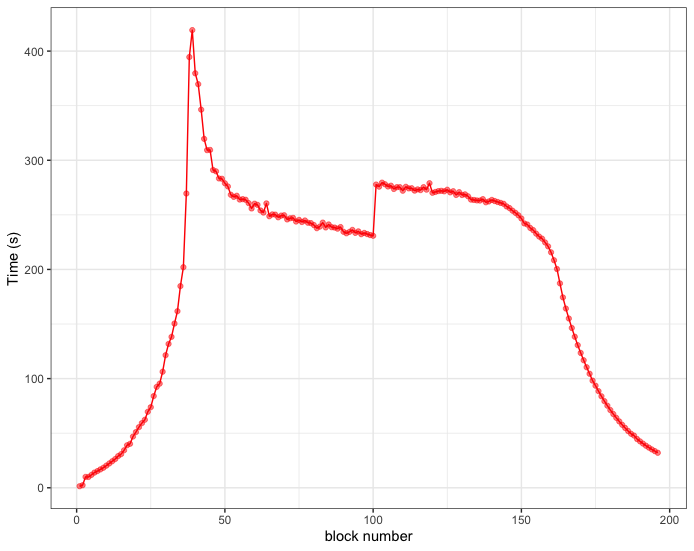

# Sample output files

Some typical sample output files.

1) **zeta14v6310057994.58p2** is a large scale t=1031 run from the `zeta14cubic.f90` code. This was run on 8 nodes (1 node has 128 processor cores) with a standard et=eps setting value of 0.005.
   
2) **zeta14v6320058493.10p2** is another large scale t=1032 run from the `zeta14cubic.f90` code where abs(Z(t)) is very large. This run illustrates the restart facilty. The first 92 blocks were run during an ARCHER2 capability day on 1024 nodes for one hour. The calculation was then restarted and blocks 93-203 were calculated using 8 nodes.

3) **zeta14v6250054222.38pm** is an example of a multi-value run from the `zeta14cubicmult.f90` code with 15 simultaneous calculations of Z(t). Run using 4 nodes.
   
4) **zeta14v6240053301.00pA2** is a small scale t=1024 run, with t specially chosen so that one has a non-zero transition term which is calculated before block zero of the main calculation commences. Again run using 4 nodes.

5) **zeta15v628000111424.67p2** is an example of a large scale t=1028 run from the zeta15quartic.f90 code. This was run using 4 nodes. Note the much smaller et=eps setting of 0.0001. Fewer blocks are needed since the initial quartic sums are larger than their cubic counterparts. 
   
Note how the number of blocks increases (logarithmically) as the scale of t increases, and the corresponding increases in the number of summands of the cubic sums, within each block. 

Notice too, the first blocks are computed very rapidly - see the figure below for the zeta14v6310057994.58p2 output file. Then the computation time increases to a maximum around block nos. 25-35. After that the block computation time slowly decreases, until very near the cut-off point when the times drop off very rapidly. (The jump at block
100 is a setting change, when the maximum order of a Gauss sum in the hierarchal chain goes from 10 down to 8, which slows the block times but improves the accuracy of the computations ever so slightly.) 

